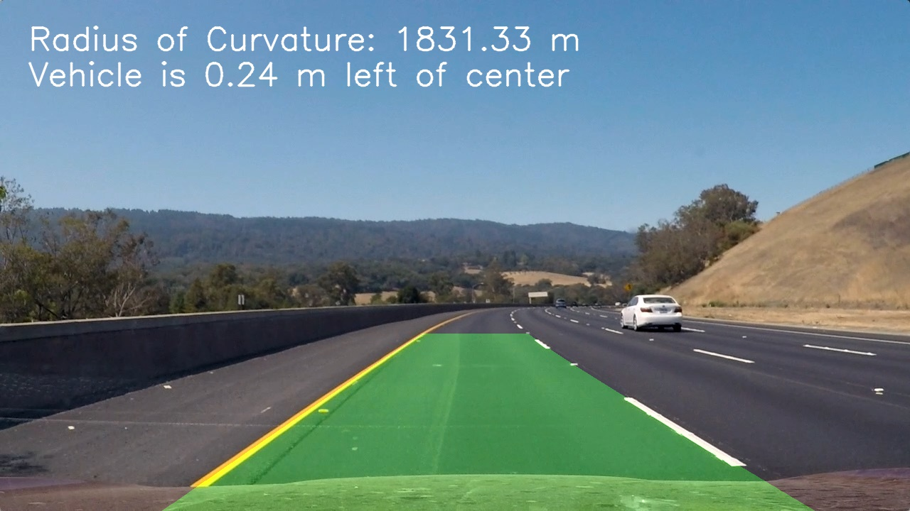
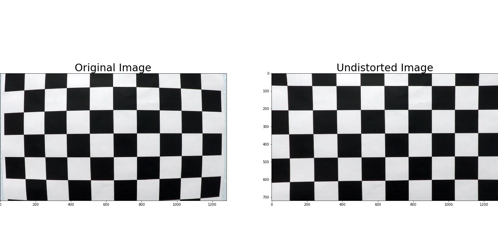
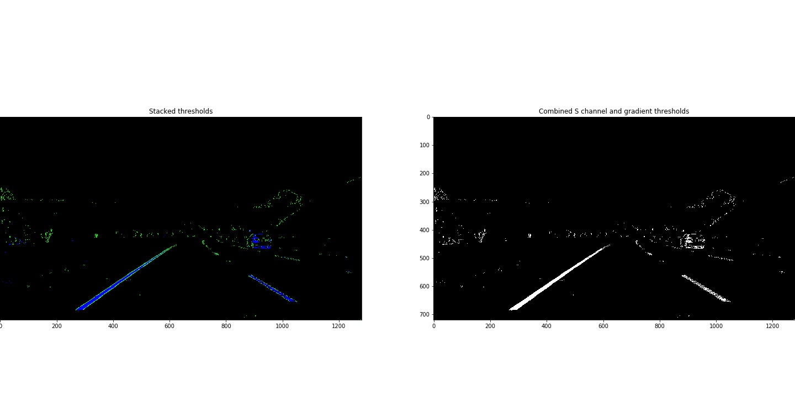
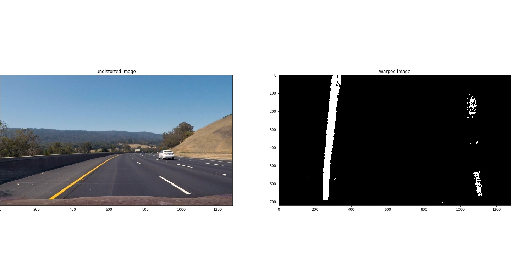
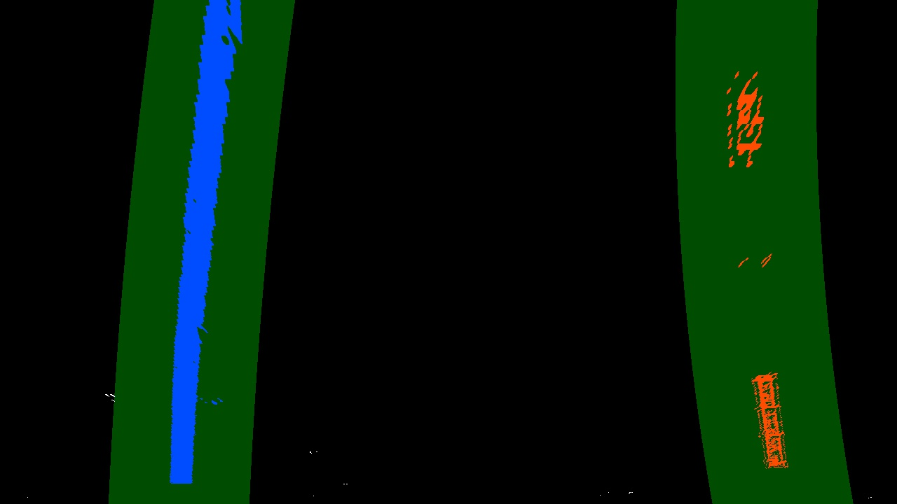

# Advanced Lane Finding
[](http://www.udacity.com/drive)



## Overview

In this project, the goal is to write a software pipeline to identify the lane boundaries in a video.

This project is the second project of the Udacity Self-Driving Car Engineer Nanodegree Program.

## Result

[](http://www.youtube.com/watch?v=F44q95Mhkto "Advanced Lane Line Detection")

Here is a short video to show my result

## The goals / steps of this project

* Compute the camera calibration matrix and distortion coefficients given a set of chessboard images.
* Apply a distortion correction to raw images.
* Use color transforms, gradients, etc., to create a thresholded binary image.
* Apply a perspective transform to rectify binary image ("birds-eye view").
* Detect lane pixels and fit to find the lane boundary.
* Determine the curvature of the lane and vehicle position with respect to center.
* Warp the detected lane boundaries back onto the original image.
* Output visual display of the lane boundaries and numerical estimation of lane curvature and vehicle position.

## Reflection

### Camera Calibration

The code for this step is contained in the first code cell of **step 1** of the IPython notebook located in "./project.ipynb".  

I start by preparing "object points", which will be the (x, y, z) coordinates of the chessboard corners in the world. Here I am assuming the chessboard is fixed on the (x, y) plane at z=0, such that the object points are the same for each calibration image.  Thus, `objp` is just a replicated array of coordinates, and `objpoints` will be appended with a copy of it every time I successfully detect all chessboard corners in a test image.  `imgpoints` will be appended with the (x, y) pixel position of each of the corners in the image plane with each successful chessboard detection.  

I then used the output `objpoints` and `imgpoints` to compute the camera calibration and distortion coefficients using the `cv2.calibrateCamera()` function.  I applied this distortion correction to the test image using the `cv2.undistort()` function and obtained this result: 



### Pipeline discription

#### 1. Apply a distortion correctionto a test image

In **step 1** I saved the distortion coefficients`(dist)` and camera metrix `(mtx)`. In this step I read a test image, the distortion coefficients`(dist)` and camera metrix `(mtx)`, use the `cv2.undistort` function to obtain undistorted image:


#### 2. Use combination of color transforms and gradients to create a thresholded binary image

I use a combination of color and gradient thresholds to generate a binary image (thresholding steps in **step 3**). Here's an example of my output for this step:



#### 3. Perform a perspective transform

The code for my perspective transform includes a function called `warp()`, which appears in **step 4** of the IPython notebook located in "./project.ipynb".  The `warp()` function takes as inputs an image (`img`), as well as source (`src`) and destination (`dst`) points. I chose the source and destination points in the following manner:

```python
src = np.float32(
    [[750, 470],
     [1100, 700],
     [250, 700],
     [580, 470]])

dst = np.float32(
    [[1100, 0],
     [1100, 700],
     [250, 700],
     [250, 0]])
```
I compute the perspective transform `(M)` and the inverse perspective transform `(Minv)` using the `cv2.getPerspectiveTransform` function and create the perspective transformed image which is shown as below:



#### 4. Identify lane-line pixels and fit their positions with a polynomial

Then in **step 5** of the IPython notebook located in "./project.ipynb" I fit my lane lines with a 2nd order polynomial kinda like this:



#### 5. Calculate the radius of curvature of the lane and the position of the vehicle with respect to center

This is shown in **step 6** of the IPython notebook located in "./project.ipynb".

#### 6. Warp the detected lane boundaries back onto the original image

I implement this step in **step 7** and add visual display in **step 8** of the IPython notebook located in "./project.ipynb". Here is an example of my result on a test image:


#### 7. Video pipeline

I write a video pipeline to apply the pipeline for images to a video. The result video is shown at the beginning.

## Discussion

Compared to the first project, this pipeline provides a better lane line detection for curved roads and roads with shadows. But this algorithm is still not robust, in some sharp curves it may fail, and the calculation costs a lot. Methods with deep learning might be a better choice.